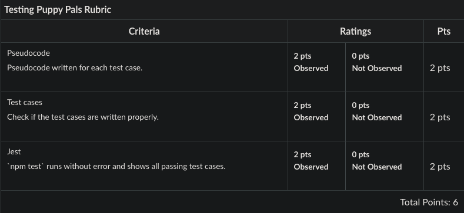

# Block 27D Workshop: Testing Puppy Pals

As a tester, you are tasked with ensuring that all functions work correctly. You decide to use Jest to test the functionality of the program.

## Overview
As a testing engineer at Puppy Pals, you play a crucial role in ensuring the quality of the site before it gets deployed. Your manager has entrusted you with the task of thoroughly testing the application to assure its quality. In this regard, you have chosen to utilize Jest as your testing framework.

The site operates by fetching data from a file called data.js, and when a puppy is selected, it displays relevant information about that particular puppy. With your expertise and diligent testing, you aim to contribute to the seamless functioning and reliability of the site.

## Rubric 
